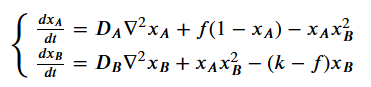

# Reaction-Diffusion Patterns on Snail Shells: Demo
## Description
This is a simple demo which builds on top of the [Reaction-Diffusion tutorial](https://github.com/axyorah/reaction_diffusion_tutorial) and shows what happens if patterns discussed in the tutorial are transferred to some interesting geometrical shapes, like snail shells.

The choice of geometrical shapes (shells) is not entirely arbitrary and is largely inspired by a great [book](https://www.springer.com/gp/book/9783540921417) on fascinating mathematics behind the curious patterns adorning the tropical shells.

Despite that "in general" mathematics behind the pattern formation is backed up by nature, don't try to find any realism in this demo: it just shows how beautiful mathematics translates into (arguably) beautiful art not bounded by any realism constraints.

In this demo you can decorate a shell with some premade static patterns, that were generated by simulating some of the more recognized reaction-diffusion systems, such as [Gierer](http://www.scholarpedia.org/article/Gierer-Meinhardt_model)-[Meinhardt](https://github.com/axyorah/reaction_diffusion_tutorial/blob/master/examples/gierer_meinhardt.ipynb) or [Gray](https://en.wikipedia.org/wiki/Reaction%E2%80%93diffusion_system)-[Scott](https://github.com/axyorah/reaction_diffusion_tutorial/blob/master/examples/gray-scott.ipynb). Here's, for example, how pattern generated by simulating Gierer-Meinhardt system will look on a shell:


Additionally, you can opt for dynamic pattern generated on the fly by solving Gray-Scott system with controllable parameters. Here's a sped up pattern generation with default parameters:


The pattern similar to the one on the animation above will take some time to develop. But you can speed things up and somewhat change the nature of the pattern formed along the way, if you toggle the parameter controls.
To build some intuition behind the parameters of the Gray-Scott system, let's first recall the system:

</img>

It is convenient to interpret `xA` as "prey" and `xB` as "predator". The equations tell us that if a "unit" of prey encounters two "units" of predators it doesn't end well for the prey (their concentration is decreased; last term in `xA` equation) but it ends quite well for the predators (predator's "concentration" is increased with the same rate; second term in `xB` equation). Additionally, prey constantly grows with the growth rate proportional to some coefficient `f`. Growth, however, slows down as the "concentration" of prey get closer to a threshold of `1` (second term in `xA` equation). At the same time predator constantly dies off with a net decay rate proportional to `k-f` (last term in `xB` equation). Here `k` can be interpreted as true predator decay coefficient. It's interesting to note that if `f > k` predator never dies, and its growth depends only on the local availability of prey.

In this demo you can regulate the growth coefficient of prey `f` and decay coefficient of predator `k`. Just play around with the controls and see what kind of patterns will emerge!

</img>

## Getting Started
### Running demo from the docker container
The simplest way to set up project environment is to let docker take care of it. If you have [docker](https://www.docker.com/):

Clone this repo to your machine:
```
$ git clone https://github.com/axyorah/snailshells.git
```

Create docker image for this project. To do this, from the directory where you cloned this repo to run:
```
$ docker build -t snailshells .
```
(If you're on Windows don't forget to make sure that docker virtual machine is running).

Run the associated docker container. On Linux or Mac:
```
$ docker run -it -v $(pwd):/shells -p 8181:8181 snailshells
```
On Windows you can run the same command, but instead of `$(pwd)` manually type in the absolute path to this directory (with brackets). Alternatively, try using git bash or any other bash instead of default Windows `cmd`. If you're still having troubles, just run the above command without `-v $(pwd):/shells` - this parameter is only needed to share the files between your machine and the container.

That's it! If you're on Linux or Mac the demo will be directly available at `localhost:8181` in your browser.
If you're on Windows the demo will be available at `192.168.99.100:8181` (`192.168.99.100` is your docker virtual machine).

### Running demo locally
To run the demo locally you need to have [node.js](https://nodejs.org/en/) installed. If you have it installed clone this repo to your machine:
```
$ git clone https://github.com/axyorah/snailshells.git
```

Set up the environment. From the directory where you've cloned this repo to run:
```
$ npm install browserify -g
$ npm install http-server -g
$ npm install three
$ npm install three-orbit-controls
$ npm install --save dat.gui
```

Set up local http server at port `8181`:
```
$ http-server . -p 8181
```

Demo will be available at `localhost:8181` in your browser.

### Adding your own custom textures
If you're running the demo locally or if you've passed `-v $(pwd):/shells` parameter when starting up docker container, you can easily add your own custom textures to the demo. To do it:
- save your texture in `./imgs/` directory,
- modify functions `init()` and `setupGui()` in `snail_shell.js`:
  - In `init()` add a line:
  ```
  textures.mytexture = new THREE.TextureLoader().load("imgs/mytexture.png");
  ```
  - In `setupGui()` add a new entry to:
  ```
  h.add( effectController, "texname", [..., "mytexture"]).name("texture name");
  ```
- run:
```
$ browserify snail_shell.js > snail_shell_bundle.js
```
After you refresh the browser your custom textures should become available in the controls. To see how to generate random patterns with beautiful mathematics check [this tutorial](https://github.com/axyorah/reaction_diffusion_tutorial).

## Acknowledgements
This demo was mainly inspired by Hans Meinhardt's book [The Algorithmic Beauty of Sea Shells](https://www.springer.com/gp/book/9783540921417). Do check it!
